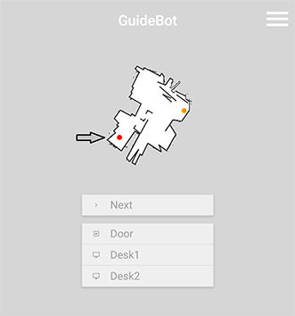
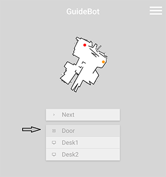
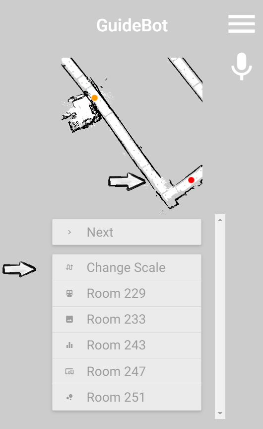
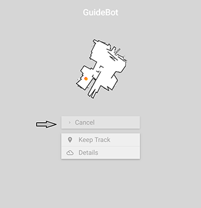
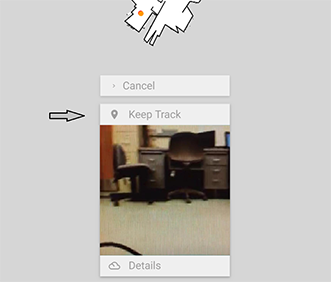
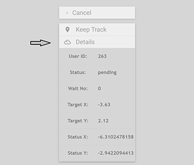
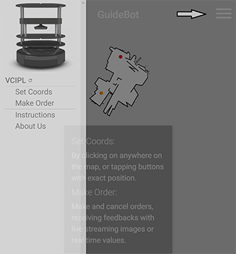

# <a href="http://ec2-18-216-168-161.us-east-2.compute.amazonaws.com/mobcmp-webapp-v-1-3-1/"> Guidebot</a>

**A Mobile Computing demo on Kobuki.**
## Set Coords
* Method 1: Tap anywhere on the map.

* Method 2: Select buttons with exact position.

## Make Order
* Click on the "Order" button to proceed.

* Click on the "Cancel" button to call off.

* Keep track by streaming images.

* View real time values.

## Other Features
* Click on the menu icon for more.

