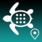
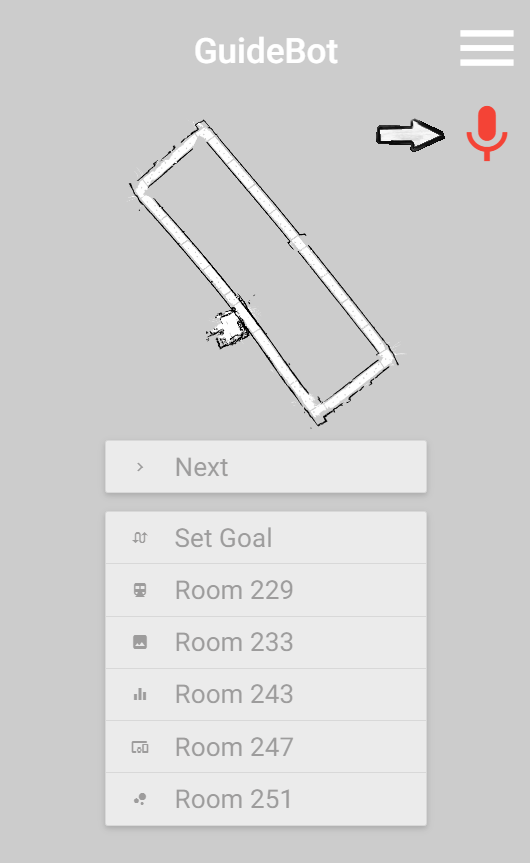

# <a href="http://ec2-18-216-168-161.us-east-2.compute.amazonaws.com/mobcmp-webapp-v-1-4-1/"> Guidebot</a>

**A Mobile Computing demo on Kobuki.**
## Set Destination
* Method 1: Tap the microphone icon and say something like, "Go to Bioengineering Lab".

* Method 2: Choose saved places and tap buttons like "Room 247".

* Method 3: Double tap the map to zoom in and tap on your destination.

## Place Order
* Tap the "Order" button to send in your request.

* View video streaming from robot's point of view.

* See the robot's location in real time.

* Tap the "Cancel" button to call off.

## Other Features
* Tap the menu icon and open side navigation menu for more.

